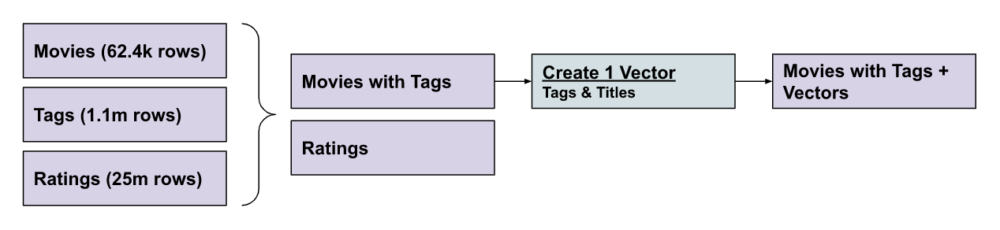
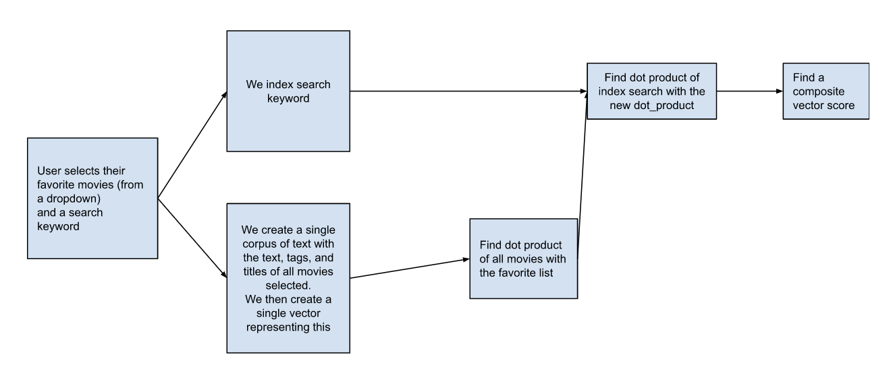

# Movie Recommender w/ SingleStore and AI

This application is designed to demonstrate how SingleStoreDB can be used to provide movie recommendations with additional filtering. We used the data from [MovieLens 25M Dataset](https://grouplens.org/datasets/movielens/25m/), which contains the following tables:



## High Level


1. Match sentence with embeddings for title and tags
2. Filter on specific criteria (e.g. rating)
3. Done in just one query!

### Query Example

``` sql
sql_query = ("With selected_movies as ( "
                "SELECT movieId,title, genres, round(DOT_PRODUCT(vector, JSON_ARRAY_PACK(%s)),3) AS Score FROM movie_with_tags_with_vectors tv "
                "order by Score DESC "
                "limit 100), "
                "movie_rating as ( "
                "SELECT title, genres, Score, round(AVG(r.rating),1) as avg_rating from selected_movies sm "
                "inner JOIN ratings AS r ON r.movieId = sm.movieId "
                "group by title, genres) "
                "select title, genres, Score, avg_rating from movie_rating "
                "where avg_rating>%s "
                )
```

## Future Work

This is future work that we might implement:

- User Profiles stored in database
- User specific secondary score to understand and improve responses based on ratings from previous recommendations
- Show two scores
    - Based on the semantic search
    - Based on prior user likes
- Tell what your favorite movies are, then use that to influence results further



## Deploying A Copy

[FIXME #6](https://github.com/arno756/movie-recommender-flask/issues/6) - Deploy instructions for users to deploy their own version of this app